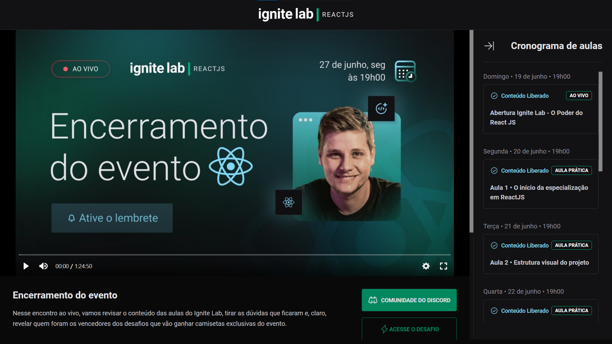

<h1 align="center">Event-ignite</h1>

# Technology (Tecnologias)

This project was developed with the following Technology:

 

<i> Esse projeto foi desenvolvido com as seguintes tecnologias:</i>

<ul>
  <li>Vite</li>
  <li>Typescript</li>
  <li>React.js</li>
  <li>React Router v6</li>
  <li>Tailwind css</li>
  <li>GraphQL</li>
  <li>GraphCMS</li>
  <li>Apollo</li>
</ul>

# Description (Descrição)

<strong>Event-ignite</strong> is a event platform with video player e subscription system. Project is still under development
given that I still intend to add responsiveness properly.

It contains the following Routes:: Subscription e MasterClass

 

<i> <strong>Event-ignite</strong> é uma plataforma de eventos com player de vídeo e sistema de inscrição.
O projeto ainda encontra-se em desenvolvimento tendo em vista que ainda pretendo adicionar responsividade propriamente.</i>

<i>Contém as seguintes Rotas: Subscription e MasterClass</i>

# Layout

 The main project page (Masterclass) is organized in 3 sections:

<b>Header</b> - Page top, where the project logo is located.

<b>MainContent</b> - Where the video player, description and others information of the selected vídeo is located.

<b>Sidebar</b> - Page right, List of the classes, including those yet to be released.

 
<i>
 A página principal do projeto (Masterclass) é organizado em 3 grupos:

<b>Cabeçalho</b> - Topo da pagina, onde localiza-se a logo do projeto.

<b>Conteúdo Principal</b> - Onde se localiza o player de vídeo, descrição e outras informações.

<b>Barra lateral</b> - Localizado a direita, A listagem de aulas com as aulas ainda para ser lançadas (de acordo com a data).
</i>

